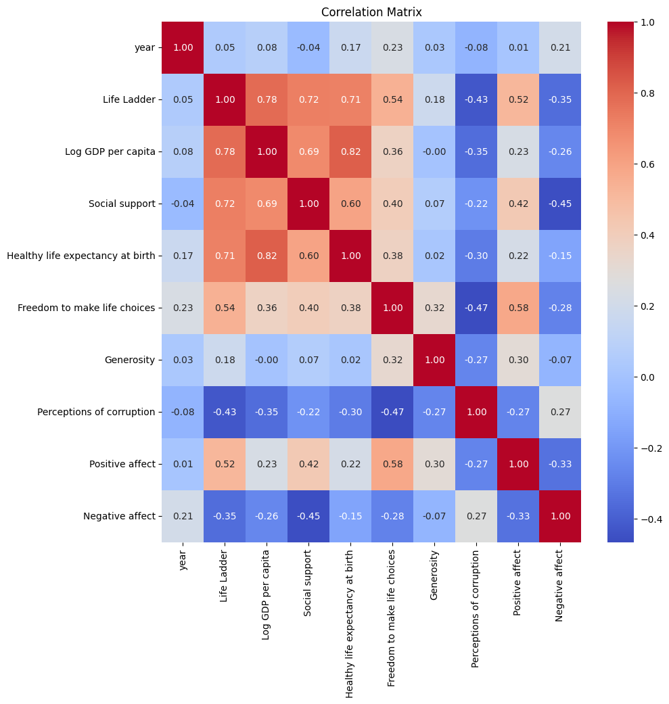
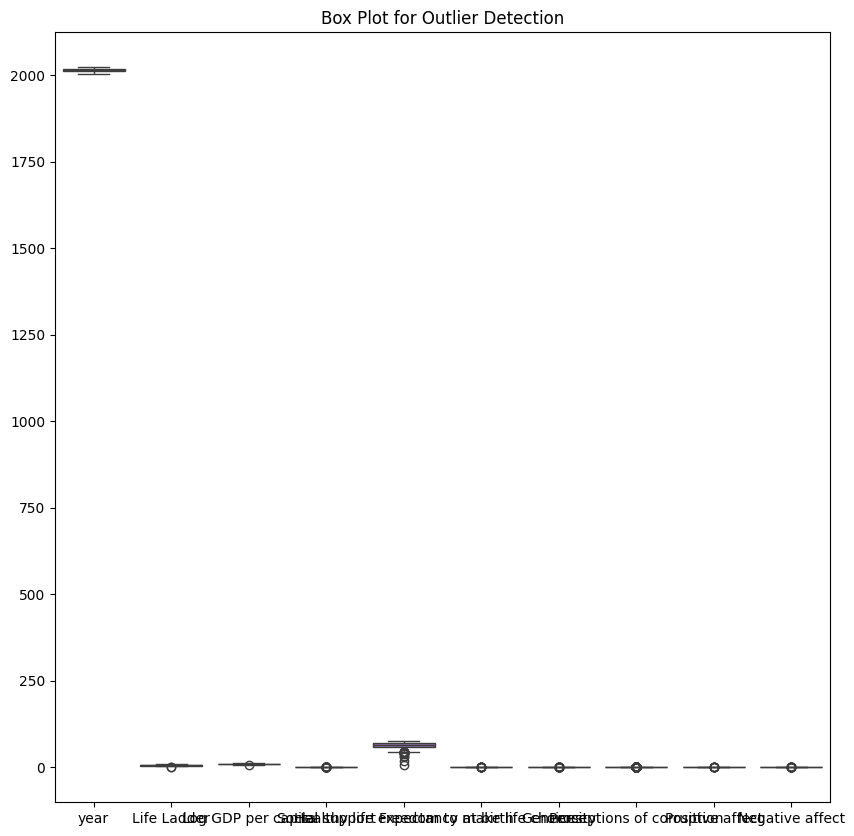
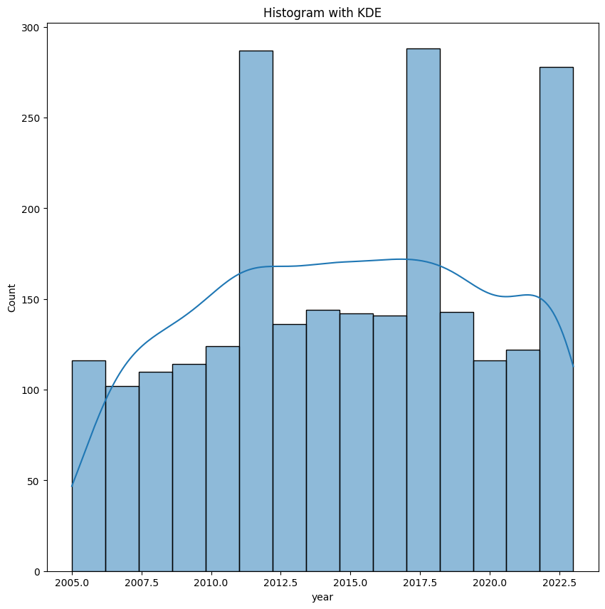

### Unveiling Global Well-being: Insights from the Happiness Dataset

In an age where happiness is often viewed as the ultimate measure of progress and prosperity, understanding what contributes to our collective sense of well-being has never been more crucial. The recent dataset encompassing 2363 data points across 11 different metrics sheds light on the components that contribute to life satisfaction across various nations over the years from 2005 to 2023. 

#### The Structure of Happiness: Exploring the Metrics

The dataset, rich with dimensions such as "Life Ladder," "Log GDP per capita," and measures of social support, paints a comprehensive picture of well-being on a global scale. It incorporates various factors, including economic indicators, health metrics, and perceptions of freedom and corruption. Each metric offers a crucial insight into the public's overall satisfaction and commitment to life.

- **Life Ladder:** Serving as a proxy for subjective well-being, this measurement reveals an average score of 5.48, with a range from a low of 1.28 to a high of 8.02. The distribution of the Life Ladder highlights the variability in life satisfaction across different countries, while outliers tell the stories of nations with extraordinary or dire circumstances.
  
- **Log GDP per Capita:** Recognizing the correlation between economic prosperity and happiness, the GDP per capita figure averages at 9.40. However, the standard deviation of 1.15 reveals significant discrepancies where income inequality could heavily affect life satisfaction.

- **Social Support and Freedom:** Averaging 0.81 and 0.75, respectively, both metrics underscore the importance of community and agency in enhancing life satisfaction. 

For deeper analysis, visualizations like the correlation matrix, boxplots, and histograms provide a graphical insight into these relationships, highlighting the interactions between various components of well-being.

#### Insights Drawn from the Data

The dataset revealed crucial insights:

1. **Economic Stability and Happiness are Interlinked:** Countries with higher GDP per capita often exhibit higher life satisfaction scores; however, mere wealth is not enough. Nations must also focus on equitable distribution of this wealth.
  
2. **The Role of Social Networks:** With social support being a significant contributor to happiness, it's evident that communities with stronger bonds achieve greater well-being.

3. **Perceptions of Corruption Matter:** The data indicate a negative correlation between perceptions of corruption and life satisfaction. Countries perceived as more corrupt tend to have lower happiness scores, illustrating the importance of governance and trust in institutions.

4. **Health is Wealth:** Healthy life expectancy plays a vital role as well, reaffirming that longer, healthier lives correlate with higher satisfaction, emphasizing the importance of healthcare access.

5. **Emotional Health:** Metrics on positive and negative affect demonstrate that emotional well-being significantly affects overall life satisfaction. A balance of positive emotions is pivotal to enhancing life's joyfulness.

#### Implications for Policymakers and Society

The insights derived from this dataset can guide policymakers in formulating strategies to enhance overall well-being. It suggests that a multifaceted approach is necessary, one that encompasses economic development, social equality, healthcare access, and good governance. Fostering community bonds and focusing on mental health resources will likely yield substantial benefits in enhancing life satisfaction.

#### Conclusion: The Path to Enhanced Well-Being

The dataset depicts a complex tapestry of happiness, intertwining economic, health, and social strands that create a vibrant picture of life satisfaction. It encourages us to reflect: happiness is not an isolated metric but the culmination of various factors that governments and communities can influence.

The take-home message is clear: if we desire a world in which happiness flourishes, a holistic approach that prioritizes economic equity, community, health, and governance is paramount. By addressing these intertwined elements, we can forge a future where well-being is not just an ideal but a reality for all. The richness of the data invites further exploration and action, serving as a powerful reminder that our collective happiness is worth the endeavor.

