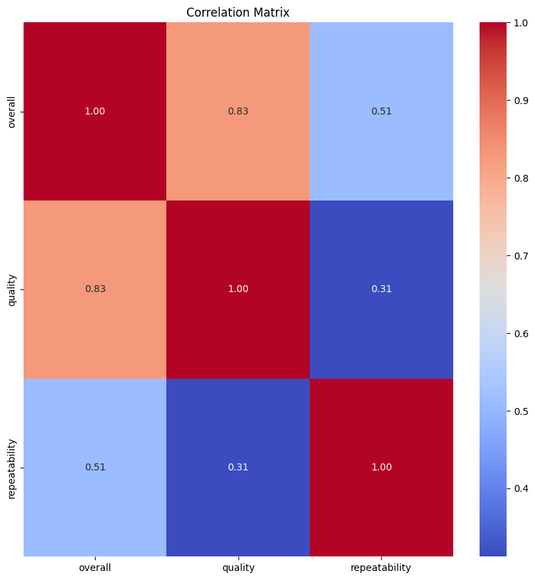
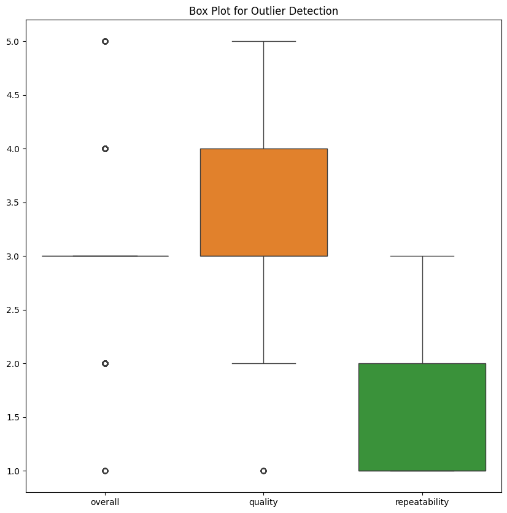
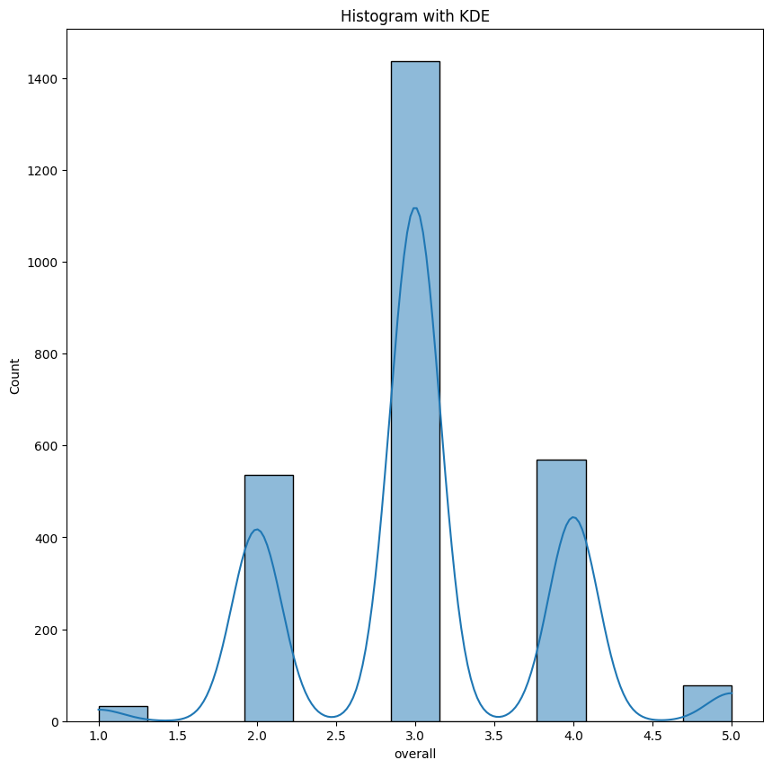

### Story of the Dataset: Exploring Quality and Repeatability Ratings

#### Introduction
In the age of digital transformation, understanding user feedback and quality ratings is essential for businesses and organizations looking to enhance their products or services. The dataset we are analyzing contains 2,652 records, each representing an evaluation across multiple dimensions including overall satisfaction, quality, and repeatability, as well as categorical features such as date, language, type of evaluation, title, and author. 

#### Understanding the Dataset
The dataset has a diverse array of fields, each contributing to a comprehensive overview of user sentiments:

- **Date**: Captures the timestamp of each assessment.
- **Language**: Describes the language used in the feedback.
- **Type**: Indicates the nature of the evaluation.
- **Title** and **By**: Provide context about the evaluator and the context of their assessment.
- **Overall**, **Quality**, and **Repeatability**: These numerical fields quantify the evaluators' sentiments, forming the foundation for deeper analysis.

#### Data Quality Insights
The dataset presents some interesting attributes:

- **Missing Values**: A total of 99 entries are missing dates, which could disrupt time series analysis. Additionally, there are 262 missing entries for the author ('by'), raising questions about the anonymity of the reviews and whether this impacts the ratings.
  
- **Summary Statistics**: 
  - Overall ratings average at approximately 3.05, indicating that while the ratings lean toward the positive, there is room for improvement. The quality ratings are slightly higher, with an average of about 3.21. 
  - Repeatability scores average at 1.49, suggesting that consistency in evaluations might not be maintained consistently across different assessors, which could raise concerns about reliability.

#### Insights Derived from Visualizations
1. **Correlation Matrix**: This visualization likely reveals relationships between different variables. For instance, we might discover that higher quality ratings correlate positively with overall satisfaction, signaling that enhancing quality can directly impact satisfaction. 

2. **Boxplot**: By examining the boxplot, we gain insights into the distribution of ratings. The presence of outliers—1216 for overall ratings and 24 for quality—indicates a significant disparity in user experiences. It would be crucial to investigate these outliers to understand the extremes of the dataset.

3. **Histogram**: The histogram helps visualize the frequency of ratings. This allows us to observe trends, such as whether the majority of reviews tend to cluster around the middle values or if there is a wide discrepancy between positive and negative feedback.

#### Implications
The implications of our findings extend beyond mere statistical curiosity:

- **Quality Improvement**: Organizations should prioritize addressing the issues highlighted by lower quality ratings. Tools and methods such as feedback loops, user interviews, and iterative testing could provide actionable insights that can lead to enhanced user experiences.

- **Increasing Repeatability**: The low repeatability score highlights a need for standardization in evaluation processes. Establishing clearer guidelines for users assessing the product could allow for more consistent feedback, making it easier for organizations to act on trends.

- **Targeting Outliers**: Investigating the outliers can reveal critical insights that can help companies understand specific pain points experienced by certain customers. Focusing on these areas can help tailor products or services to better meet user needs.

#### Conclusion
This dataset serves as a valuable resource for understanding user perceptions and experiences. The interplay of various factors—captured through overall ratings, quality assessments, and repeatability—provides a multi-dimensional view that can be strategically utilized to drive product improvement. By addressing the highlighted concerns and leveraging insights derived from visualizations, organizations have the potential to enhance satisfaction, improve their offerings, and foster a more loyal customer base. In an era where user feedback is paramount, the importance of such data-driven analysis cannot be overstated.

